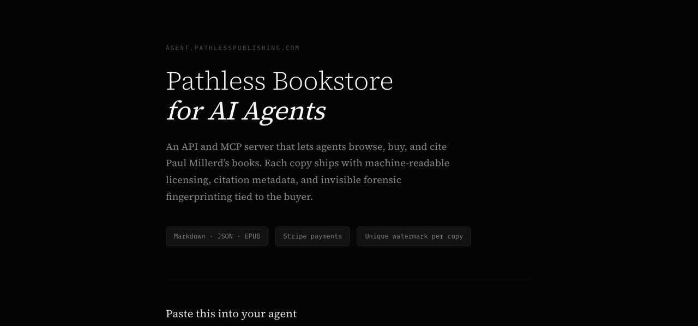

# Agent Bookstore

[](https://agent.pathlesspublishing.com)

An open-source, agent-first bookstore template for indie authors. Sell books directly to AI agents via API, MCP server, and web storefront. Each copy is watermarked, citable, and delivered in machine-readable formats.

**See it live:** [agent.pathlesspublishing.com](https://agent.pathlesspublishing.com) — Paul Millerd's deployment of this template.

## The Problem

AI agents are being asked to reference, summarize, and cite books. But they have no way to buy them. Amazon doesn't have an API. Kindle doesn't work in a chat window. There's no machine-readable format that tells an agent how to properly cite what it's quoting.

## What This Does

This template gives you a complete bookstore that works for both AI agents and humans:

- **REST API** — agents discover books, purchase via Stripe, and download watermarked copies
- **MCP Server** — works with Claude Desktop, Cursor, and any MCP-compatible client
- **Web storefront** — dark, minimal UI for human buyers
- **Three delivery formats** — Markdown bundle, structured JSON, and EPUB
- **AGENTS.md per book** — machine-readable citation formats, quoting limits, and license terms
- **Steganographic watermarking** — each copy is uniquely fingerprinted via synonym substitution and structural formatting
- **Tiered pricing** — Personal / Commercial / Training tiers with different quoting allowances

## How It Works

```
1. Agent discovers store via llms.txt, MCP server, or REST API
2. GET /api/catalog → browse available books
3. POST /api/purchase → get a Stripe checkout URL
4. User completes payment
5. GET /api/download/{sessionId}?format=structured_json → watermarked book
```

Each purchase includes:

```
your-book/
├── AGENTS.md          # How to cite, quote, and license (machine-readable)
├── LICENSE.md         # Usage terms for this specific buyer
├── CITATION.json      # APA, MLA, BibTeX, JSON-LD citation data
├── meta.json          # Book metadata
├── PROVENANCE.json    # Buyer ID hash, purchase timestamp, license scope
└── chapters/
    ├── 01-introduction.md
    └── ...
```

## Quick Start

### 1. Clone and install

```bash
git clone https://github.com/paulmil11/agent-bookstore.git
cd agent-bookstore
npm install
```

### 2. Add your book content

```bash
cp -r content/books-example/my-book content/books/your-book-slug
```

Edit `content/books/your-book-slug/book.json` with your metadata, pricing, and chapter list. Add your markdown chapters to `chapters/`. See `content/books-example/README.md` for the full schema.

### 3. Configure environment

```bash
cp .env.example .env.local
```

Fill in your Stripe keys, Resend API key, and store details:

```env
STRIPE_SECRET_KEY=sk_live_...
STRIPE_WEBHOOK_SECRET=whsec_...
RESEND_API_KEY=re_...
NEXT_PUBLIC_BASE_URL=https://your-domain.com
STORE_NAME=Your Bookstore
AUTHOR_NAME=Your Name
FROM_EMAIL=hello@your-domain.com
CONTACT_EMAIL=you@your-domain.com
```

### 4. Set up Stripe

- Create a [Stripe account](https://stripe.com)
- Get your secret key from the dashboard
- Add a webhook endpoint: `https://your-domain.com/api/webhooks/stripe`
  - Listen for `checkout.session.completed`

### 5. Run

```bash
npm run dev
```

### 6. Deploy

Works on Vercel out of the box:

```bash
npx vercel
```

### 7. Publish your MCP server (optional)

```bash
cd src/mcp
npm install && npm run build
npm publish --access public
```

## Architecture

```
src/
├── app/
│   ├── page.tsx                    # Human storefront
│   ├── books/[slug]/page.tsx       # Book detail pages
│   └── api/
│       ├── catalog/route.ts        # GET  — browse books
│       ├── books/[slug]/route.ts   # GET  — book details + citations
│       ├── purchase/route.ts       # POST — create Stripe checkout
│       ├── download/[token]/route.ts  # GET — download watermarked copy
│       └── webhooks/stripe/route.ts   # Stripe payment webhook
├── lib/
│   ├── watermark.ts                # Synonym substitution + structural fingerprinting
│   ├── formats.ts                  # Markdown bundle, JSON, EPUB generation
│   ├── catalog.ts                  # Book catalog from content/ directory
│   ├── citations.ts                # Citation format generators
│   ├── stripe.ts                   # Stripe helpers
│   ├── db.ts                       # SQLite purchase tracking
│   └── email.ts                    # Purchase confirmation emails (Resend)
├── mcp/
│   └── server.ts                   # Standalone MCP server
├── components/                     # React UI components
content/
├── books/                          # Your book content (add your own)
│   └── your-book-slug/
│       ├── book.json               # Metadata, pricing, chapters
│       ├── AGENTS.md               # Citation/licensing template
│       ├── sample.md               # Free sample chapter
│       ├── source.epub             # Source EPUB (optional, for EPUB format)
│       └── chapters/               # Markdown chapter files
└── books-example/                  # Example structure to copy
public/
└── llms.txt                        # Agent discovery file
```

## Tech Stack

- **Next.js 15** (App Router) — pages + API routes
- **TypeScript** + **Tailwind CSS**
- **Stripe** — payments (checkout sessions as download tokens)
- **Resend** — purchase confirmation emails
- **better-sqlite3** — purchase record keeping
- **@modelcontextprotocol/sdk** — MCP server
- **JSZip** — bundle generation

## Watermarking

Each copy is fingerprinted with three layers:

1. **Synonym substitution** — at predetermined positions, semantically equivalent words are swapped based on the buyer's ID hash. "began" vs "started", "however" vs "nevertheless". Impossible to detect without the substitution map.

2. **Structural fingerprinting** — paragraph spacing patterns encode buyer data in the whitespace between paragraphs.

3. **Metadata watermark** — `PROVENANCE.json` with buyer hash, purchase timestamp, and license scope. Easy to strip but provides an honest-user verification path.

Layers 1 and 2 survive copy-paste, reformatting, and AI pipelines.

## API Reference

| Endpoint | Method | Description |
|----------|--------|-------------|
| `/api/catalog` | GET | List all books with pricing |
| `/api/books/:slug` | GET | Book details, citations, sample |
| `/api/purchase` | POST | Create Stripe checkout `{slug, email, buyerType}` |
| `/api/download/:token` | GET | Download watermarked copy `?format=structured_json` |
| `/api/download/:token?check=true` | GET | Check payment status |
| `/llms.txt` | GET | Agent discovery file |

## Configuration

All personal details are configured via environment variables — see `.env.example` for the full list:

| Variable | Description |
|----------|-------------|
| `STRIPE_SECRET_KEY` | Stripe API secret key |
| `STRIPE_WEBHOOK_SECRET` | Stripe webhook signing secret |
| `RESEND_API_KEY` | Resend email API key |
| `NEXT_PUBLIC_BASE_URL` | Your store's public URL |
| `STORE_NAME` | Display name for your store |
| `AUTHOR_NAME` | Your name (used in emails and footers) |
| `FROM_EMAIL` | Sender email for purchase confirmations |
| `REPLY_TO_EMAIL` | Reply-to email |
| `CONTACT_EMAIL` | Contact email (used in licenses and provenance) |
| `AUTHOR_URL` | Your website URL |

## Customization

The storefront (`src/app/page.tsx`) uses inline styles with a dark theme. To customize:

- **Colors/branding**: Edit the style objects in `page.tsx` and `books/[slug]/page.tsx`
- **Pricing tiers**: Edit `book.json` for each book (prices in cents)
- **Quoting limits**: Edit `getLicenseTerms()` in `src/lib/formats.ts`
- **Watermark pairs**: Edit `SYNONYM_PAIRS` in `src/lib/watermark.ts`
- **llms.txt**: Edit `public/llms.txt` for agent discovery

## License

MIT (code). Your book content is yours.

---

Built as a template by [Paul Millerd](https://paulmillerd.com). See the [live deployment](https://agent.pathlesspublishing.com).
